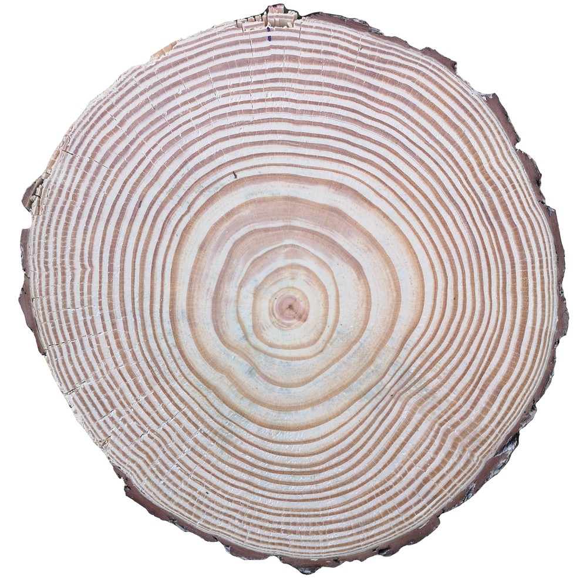
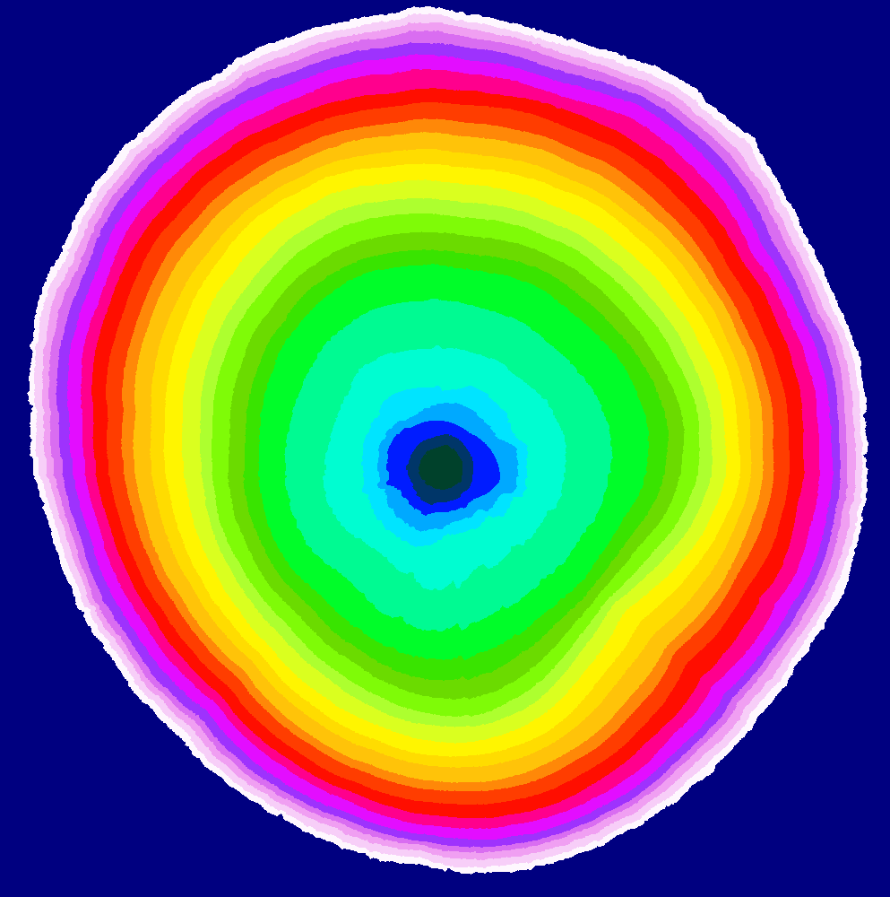
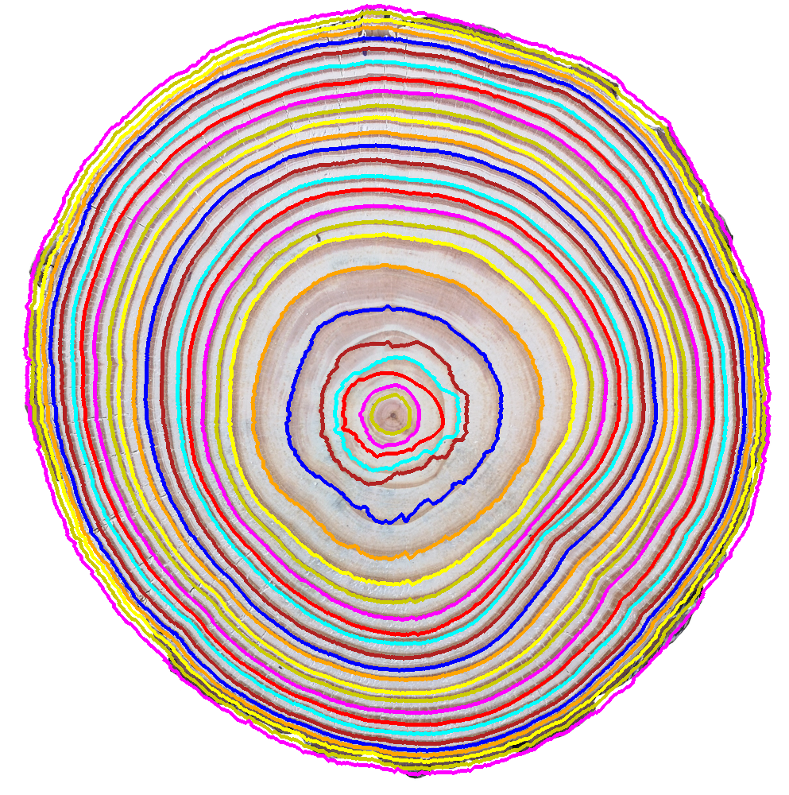

# A Brief Analysis of the Iterative Next Boundary Detection Network for Tree Rings Delineation in images of Pinus Taeda
The INBD model proposed in the paper "Iterative Next Boundary Detection for Instance Segmentation of Tree Rings in Microscopy Images of Shrub Cross Sections" was trained on the Pinus taeda species. 
The model was trained using the UruDendro dataset, which contains annotations in the UruDendro format. The INBD model was evaluated using the UruDendro metric.

Demo for the model is available at [Demo](https://ipolcore.ipol.im/demo/clientApp/demo.html?id=77777000523&key=FF374F2900F98F32912B65BA925739A4). A brief article describing the experiments made over the dataset is available at [MLBrief](https://arxiv.org/abs/2408.14343).

|       |              |
|------------------------------------|-----------------------------------------|
|  |  |

## Installation
### INBD
Go to ./INBD

### UruDendro
Go to ./urudendro

## Procedure
1. Download the dataset from the following link:
```bash
python uruDendro/dataset.py --download --dataset_path DATASET_DIR
```

Where: 
- `DATASET_DIR` is the path where the dataset will be downloaded. `DATASET_DIR` must be an absolute path.


2. Transform the UruDendro annotations to the INBD format:
```bash
python uruDendro/src/dataset_urudendro.py --dataset_dir DATASET_DIR --output_folder DATASET_SIZE_DIR --size SIZE
```

Where:
- `DATASET_DIR` is the path to the dataset folder.
- `DATASET_SIZE_DIR` is the path to the output folder.
- `SIZE` is the size of the images in pixels

It is possible to resize the INBD dataset using the following command:
```bash
python uruDendro/src/dataset_inbd.py --resize --dataset_dir DATASET_DIR --output_folder DATASET_SIZE_DIR --size SIZE
```

Where:
- `DATASET_DIR` is the path to the dataset folder.
- `DATASET_SIZE_DIR` is the path to the output folder.
- `SIZE` is the size of the images in pixels

3. Train the model using the following command (INBD Readme):
```bash
python INBD/main.py train segmentation DATASET_SIZE_DIR/train_inputimages.txt DATASET_SIZE_DIR/train_annotations.txt
```
```bash
python INBD/main.py train INBD DATASET_SIZE_DIR/train_inputimages.txt DATASET_SIZE_DIR/train_annotations.txt --segmentationmodel=checkpoints/segmentationmodel/model.pt.zip
```

4. Inference using the following command (test annotations are used to get the pith center boundary):
```bash
python src/inbd_inference_with_center_boundary.py --input_images_path
DATASET_SIZE_DIR/test_images.txt
--input_annotations_path
DATASET_SIZE_DIR/test_annotations.txt
--root_dataset
DATASET_SIZE_DIR
--output_dir
INBD_RESULTS
--inbd_model_path
INBD_MODEL_PATH
```
    
Where:
    - `DATASET_SIZE_DIR` is the path to the dataset folder.
    - `INBD_RESULTS` is the path to the output folder.
    - `INBD_MODEL_PATH` is the path to the INBD model.

5. Evaluate the model using the following command (INBD metric):
```bash
python INBD/main.py evaluate INBD_RESULTS DATASET_SIZE_DIR/test_annotations.txt
```

Where:
- `INBD_RESULTS` is the path to the INBD results folder.
- `DATASET_SIZE_DIR` is the path to the dataset folder.

6. Evaluate the model using the following command (UruDendro metric). First INBD results are transformed to UruDendro format:
```bash
python src/from_inbd_to_urudendro.py --root_dataset DATASET_SIZE_DIR 
--root_inbd_results
/data/maestria/resultados/mlbrief_PinusTaedaV1_1500/inference/inbd_results/inbd_
--output_dir
/data/maestria/resultados/mlbrief_PinusTaedaV1_1500/inference/inbd_results/inbd_
```
Then, the UruDendro metric is computed:
```bash
python src/compute_urudendro_metric.py ----annotations_file_path ANNOTATIONS_FILE_PATH  --root_original_dataset DATASET_DIR
--output_dir OUTPUT_DIR --inbd_inference_results_dir INBD_RESULTS --inbd_center_mask_dir INBD_RESULTS/center
```

Where:
- `ANNOTATIONS_FILE_PATH` is the path to the UruDendro annotations file.
- `DATASET_DIR` is the path to the original dataset folder.
- `INBD_RESULTS` is the path to the INBD results folder. INBD_RESULTS/center is where the center mask images are located using during the inference.


